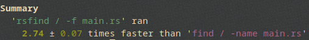
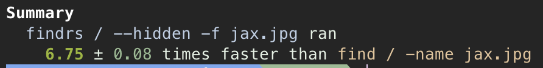

# rsfind 

### like linux `find`, but faster and simpler

wanted to try to make a cli with rust, so i 'remade' find 

### installation

* with cargo: `cargo install rsfind`

### usage

* `rsfind [OPTIONS] <path>`, path is the root path you would like to search within

##### options

* `-e, --extension <EXT>`: search for files of a specific extension
* `--hidden`: extend search to hidden directories
* `--empty`: search for empty directories
* `-f, --file <FILE>`: file or directory to search for
* `-V, --version`: show version info
* `-h, --help`: show help info

### performance vs `find`

