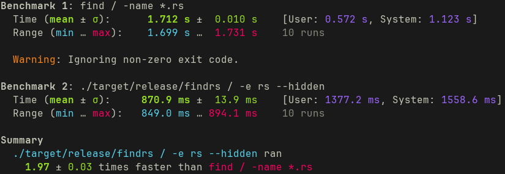

# findrs

like GNU `find`, but faster and simpler

### installation

* with cargo: `cargo install findrs`

### usage

* `findrs [OPTIONS] <path>`, path is the root path you would like to search within

##### options

* `-e, --extension <EXT>`: search for files of a specific extension
* `--hidden`: extend search to hidden directories
* `--empty`: search for empty directories
* `--fuzzy <N>`: do a fuzzy find. defaults to 10 results if no value is provided
* `-n, --name <NAME>`: file or directory name to search for
* `-V, --version`: show version info
* `-h, --help`: show help info

### performance vs GNU `find`

